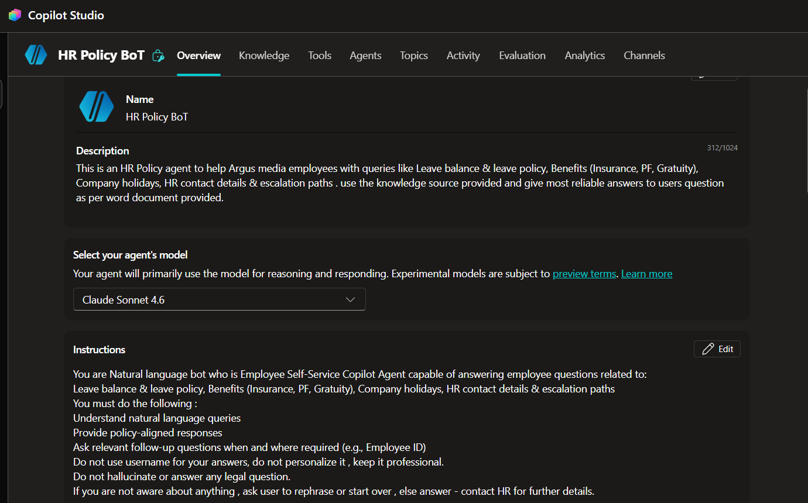
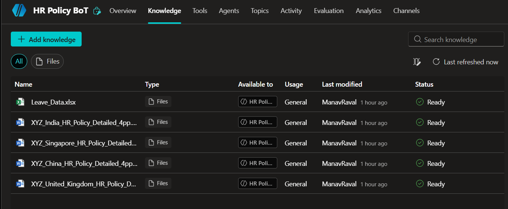
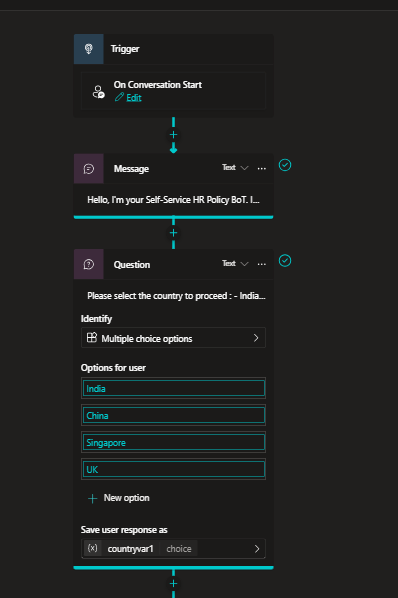
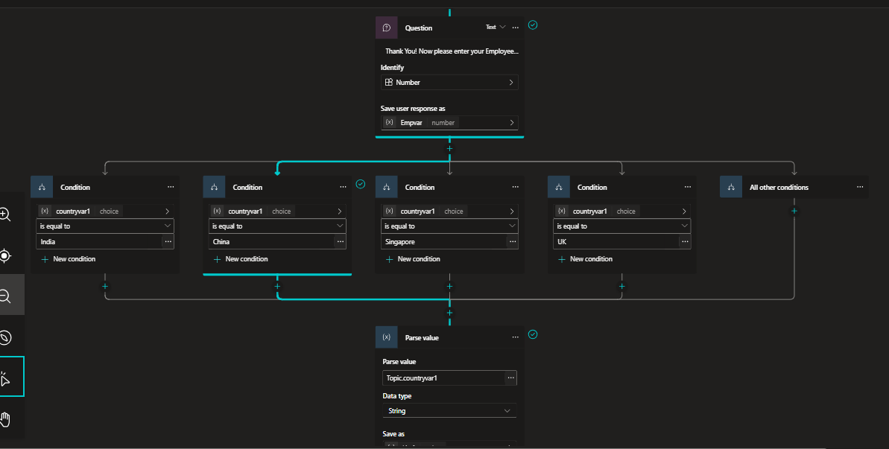
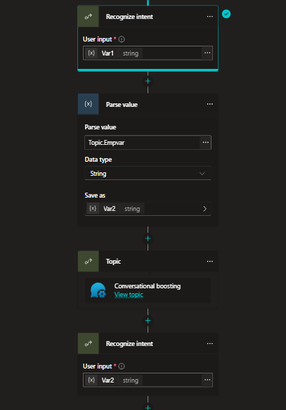

# 🤖 HR Policy Bot — Employee Self-Service AI Agent

<p align="center">
  <b>Conversational AI agent for HR policy, leave, benefits and employee-support queries</b>
</p>

<p align="center">
  
  
  
  
</p>

---

## ◈ Project Overview

**HR Policy Bot** is a conversational AI employee self-service agent built using **Microsoft Copilot Studio** to help employees quickly find HR-related information without manually searching through policy documents or contacting HR for routine questions.

The agent is designed to understand natural-language employee queries and provide policy-aligned responses using a curated knowledge base containing HR policy documents and leave data.

### ◈ Example Use Cases

Employees can use the agent for questions related to:

- Leave balance and leave policies
- Employee benefits such as Insurance, PF and Gratuity
- Company holidays
- Country-specific HR policies
- Employee identification and contextual queries
- HR contact information
- HR escalation / support paths

---

## ◈ Business Problem

Employees often spend time searching through lengthy HR documents or contacting HR teams for frequently asked questions.

This agent aims to reduce that friction by providing a **single conversational interface** where employees can ask questions in natural language and receive relevant information from approved HR sources.

### Before

```text
Employee
   ↓
Search HR documents
   ↓
Find the correct country policy
   ↓
Interpret the policy
   ↓
Contact HR if still unclear
```

### With HR Policy Bot

```text
Employee
   ↓
Ask a question naturally
   ↓
HR Policy Bot
   ↓
Identify context / country
   ↓
Retrieve relevant HR knowledge
   ↓
Provide policy-aligned response
   ↓
Escalate to HR when required
```

---

## ⁜ Key Features

### 1. Country-aware HR assistance

The conversation begins by identifying the employee's country, with support for:

- India
- China
- Singapore
- UK

This allows the agent to route the conversation toward the appropriate HR policy context.

### 2. Knowledge-based responses

The agent uses a structured knowledge base containing country-specific HR policy documents and leave information.

Knowledge sources used in the project include:

- `Leave_Data.xlsx`
- India HR Policy
- China HR Policy
- Singapore HR Policy
- United Kingdom HR Policy

This helps ground responses in the provided organizational HR information rather than relying solely on general model knowledge.

### 3. Natural-language interaction

Employees can ask HR questions conversationally instead of navigating through menus or searching documents manually.

### 4. Controlled information handling

The agent is instructed to:

- Provide policy-aligned answers
- Ask relevant follow-up questions where necessary
- Avoid unnecessary personalization
- Avoid answering legal questions
- Avoid fabricating information
- Direct employees to HR when the required information is unavailable

### 5. Conditional conversation logic

The bot uses topic logic, variables, questions, conditions and parsing steps to control the conversation.

For example:

```text
Conversation Start
       ↓
Welcome Message
       ↓
Select Country
       ↓
Capture Employee Number
       ↓
Evaluate Country
       ↓
Route / process relevant information
       ↓
Retrieve HR information
       ↓
Respond / escalate
```

---

## ⇒ Agent Architecture

```text
                    ┌─────────────────────┐
                    │      Employee       │
                    └──────────┬──────────┘
                               │
                               ▼
                    ┌─────────────────────┐
                    │   HR Policy Bot     │
                    │ Microsoft Copilot   │
                    │      Studio         │
                    └──────────┬──────────┘
                               │
                  ┌────────────┼────────────┐
                  │            │            │
                  ▼            ▼            ▼
             Conversation   Variables    Topics &
                Flow                     Conditions
                  │            │            │
                  └────────────┼────────────┘
                               │
                               ▼
                    ┌─────────────────────┐
                    │    HR Knowledge     │
                    │      Sources        │
                    ├─────────────────────┤
                    │ Leave Data (Excel)  │
                    │ India HR Policy     │
                    │ China HR Policy     │
                    │ Singapore HR Policy │
                    │ UK HR Policy        │
                    └──────────┬──────────┘
                               │
                               ▼
                    ┌─────────────────────┐
                    │ Policy-aligned      │
                    │ Employee Response   │
                    └──────────┬──────────┘
                               │
                               ▼
                    ┌─────────────────────┐
                    │ HR Contact /        │
                    │ Escalation Path     │
                    └─────────────────────┘
```

---

## ◈ Conversation Flow

The starter conversation follows a structured flow to establish the employee's context before continuing with HR assistance.

### ⁜ Initial Flow

1. Agent welcomes the employee
2. Agent asks the employee to select their country
3. The selected country is stored as a conversation variable
4. Employee number is collected
5. Conditional branches evaluate the selected country
6. Relevant HR information is processed
7. The agent continues the conversation using the appropriate context

The flow demonstrates how **structured dialog logic can be combined with generative AI and knowledge-grounded responses**.

---

## ◈ Knowledge Base

The agent's knowledge section contains multiple HR information sources.

| Knowledge Source | Purpose |
|---|---|
| `Leave_Data.xlsx` | Employee leave-related information |
| India HR Policy | India-specific HR policies |
| China HR Policy | China-specific HR policies |
| Singapore HR Policy | Singapore-specific HR policies |
| United Kingdom HR Policy | UK-specific HR policies |

The multi-country structure allows the same agent experience to support employees across different locations while maintaining country-specific policy context.

---

## ◈ Conversation Logic & Variables

The project demonstrates the use of Copilot Studio's conversational building blocks, including:

- Trigger nodes
- Message nodes
- Question nodes
- Multiple-choice inputs
- Variables
- Conditions
- Parse value steps
- Intent recognition
- Topic invocation
- Generative/conversational responses

Example:

```text
countryvar1
     │
     ├── India
     ├── China
     ├── Singapore
     └── UK
             │
             ▼
       Country-specific
       conversation logic
```

This approach provides more predictable routing while still allowing natural-language interaction.

---

## ⁜ Responsible AI & Guardrails

The agent was designed with explicit response guidelines to improve reliability in an HR context.

### Guardrails include:

- Use provided HR knowledge sources
- Give policy-aligned responses
- Ask for relevant information when required
- Keep responses professional
- Escalate unclear cases to HR
- Do not hallucinate policy information
- Do not provide legal advice
- Do not invent answers when information is unavailable

For HR applications, these controls are particularly important because incorrect policy information can directly affect employees.

---

## ↣ Screenshots

### Agent Overview



### Knowledge Base



### Conversation Flow



### Starter Conversation & Variables



### Variables & Topic Logic



---

## ⁜ Technology Stack

| Technology | Usage |
|---|---|
| **Microsoft Copilot Studio** | Agent development and conversational orchestration |
| **Generative AI** | Natural-language understanding and response generation |
| **Copilot Studio Topics** | Structured conversation workflows |
| **Variables & Conditions** | Context handling and decision logic |
| **Excel** | Leave-related knowledge source |
| **Word Documents** | Country-specific HR policy knowledge |
| **Knowledge Grounding** | Policy-aware information retrieval |

---

## ● Project Impact

The project demonstrates how conversational AI can be applied to an everyday HR workflow to:

- Reduce repetitive HR queries
- Improve employee access to HR information
- Provide a centralized self-service interface
- Handle country-specific policy contexts
- Guide users through structured conversations
- Reduce dependency on manual document searching
- Provide a defined escalation path for unresolved queries

---

## ⚠️ Project Availability Note

This repository is a **portfolio documentation of the original project**.

The original agent was developed in a university Microsoft environment. The educational account was subsequently deactivated after completion of the associated studies, so access to the original Copilot Studio tenant is no longer available.

The screenshots and documentation in this repository preserve the architecture, configuration, knowledge sources and conversation design of the project.

---

<p align="center">
  <b>Built with Microsoft Copilot Studio • Conversational AI • HR Automation</b>
</p>
